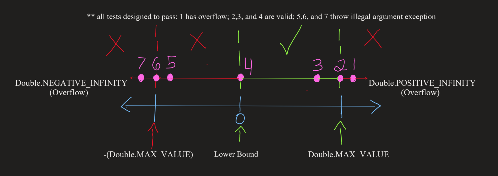

**SENG 438 - Software Testing, Reliability, and Quality**

> **Assignment #2**

> **Lab. Report \#2 – Requirements-Based Test Generation**

| Group \#:       | G38  |
|-----------------|---|
| Student Names:  | Tony Vo, Chace Nielson, Chad Holst, Olisehemeka Chukwuma |

**Table of Contents**

[1 Introduction](#1-introduction)

[2 Detailed descriptions of unit test strategy](#2-detailed-descriptions-of-unit-test-strategy)

[3 Test cases developed](#3-test-cases-developed)

[4 How the teamwork/effort was divided and managed](#4-how-the-teamworkeffort-was-divided-and-managed)

[5 Difficulties encountered, challenges overcome, and lessons learned](#5-difficulties-encountered-challenges-overcome-and-lessons-learned)

[6 Comments/feedback on the lab itself](#6-commentsfeedback-on-the-lab-itself)

# 1 Introduction

In this assignment, we were given the Java library JFreeChart, which is used for creating interactive charts. The objective of this assignment is to create unit tests for certain methods from JFreeChart. This assignment was focused on Weak Equivalence Class Testing (WECT) and black-box testing. As such, we were provided with a function’s signature, arguments accepted, description, and a return value, but were not shown the code for the implementation of the method. From this, we devised a unit test strategy to effectively write enough tests to cover WECT for the arguments of the method. When needed, the Java mocking library jMock was used to mock objects such as Values2D and KeyedValues in the DataUtilities class.

Before this assignment, all group members had limited unit testing abilities. In a previous course, ENSF 409 (which was taken by all members), unit testing was briefly taught and used in some assignments and the final project, but not to the extent present in this assignment (such as mocking objects and using @Before and @After).

# 2 Detailed descriptions of unit test strategy
Our test strategy was to use the technique of Weak Equivalence Class Testing (WECT). We’ve calculated the max() in order to decipher how many tests seem appropriate for each method. We have provided an example diagram to visually display our testing strategy for the domain of the first method. We have tested the boundary values of certain tests and have attempted to include all equivalence classes for the rest of the tests. The following contains the corresponding WECT max() calculations for each method tested:

### Test cases 1- 7 for getUpperBound()

Weak Equivalence Testing

max(2,5) = 5 test cases 

However, 2 more test cases were included.

Test cases 8 - 11 for calculatedRowTotal():

Weak Equivalence Testing

max(2,3) = 3 test cases

An additional test case was used to check that an exception was thrown for null data

Test cases 12 - 15 for contains():

Weak Equivalence Testing

max(2,3) = 3 test cases

An additional test case (13) was used to check the same value for upper bound, upper bound, and return value

Test cases 16 - 21 for getLength():

Weak Equivalence Testing

max(0,3) = 3 test cases

3 test cases (test cases #19-21) were focused on the endpoints, with one test going beyond the lower bound of Double.NEGATIVE_INFINITY to test integer overflow, one test going beyond the upper bound of Double.POSITIVE_INFINITY to test integer overflow, and one test exactly at the bounds of [Double.NEGATIVE_INFINITY, Double.POSITIVE_INFINITY]. In addition, 3 more tests (test cases #16-18) were done within these bounds, where one test (#16) had a nominal and positive range, another test (#17) had a range with a length of 0, and the third test (#18) had a nominal and negative range. 

Test cases 22 - 23 for createNumberArray(double[] data):

Weak Equivalence Testing

max(0,2) = 2 test cases

2 test cases were created. The first test case (#22), focused on passing a null double array into createNumberArray(double[] data) and expected an IllegalArgumentException to be thrown. The second test case (#23) focused on passing in a double array containing some Double values and expected a Number array to be returned that contains the same Double values that was passed in.

Test cases 24-25 for createNumberArray2D(double [][] data): 

Test cases 26-28 for constrain(double data):

Assuming that  the valid range for the Range object is from -100,000 to 100,000 and given that the 

Test cases for 29-36 for getLowerBound():

Weak Equivalence Testing

max(0,3) = 3 test cases 

3 tests were done around each endpoint for a total of 7 tests and one more test case was added to test an exception of the range class

(See diagram for GetUpperBound(), these two methods are just opposites but the same strategy was applied)

8 tests total were created

Test cases for 37-41 for equal(double [][] a, double [][] b):

Weak Equivalence Testing

max(2,3) = 3 test cases

Partitions were the combo of null and null array nun and non null array and two non null arrays

One extra test was added to test a 2d array with different dimensions 

And a test case was added to ensure false was returned when arrays had different values

5 tests total were created

Test cases for 42-45 for calculateColumnTotal(Values2D data, int column):

Weak Equivalence Testing

max(2,3) = 3 test cases

Partitlas were made with max values and max negative values as input for a boundary cases for 3 partitions

An additional test case was used to check that an exception was thrown for null data

4 tests were created total

# 3 Test cases developed

<table>
  <tr>
   <td>Test Case #
   </td>
   <td>Method Under Test
   </td>
   <td>Inputs 
   </td>
   <td>Expected Output
   </td>
   <td>Actual Output
   </td>
   <td>Pass/Fail
   </td>
  </tr>
  <tr>
   <td>1
   </td>
   <td>getUpperBound()

(test  above max)

Class: Range
   </td>
   <td>Range Object Inputs:

0.0 

Double.MAX_VALUE*1.01
   </td>
   <td>Double.POSITIVE_INFINITY

(since overflow occurs)
   </td>
   <td>Double.POSITIVE_INFINITY

(since overflow occurs)
   </td>
   <td>Pass
   </td>
  </tr>
  <tr>
   <td>2
   </td>
   <td>getUpperBound()

(test on max)

Class: Range
   </td>
   <td>Range Object Inputs:

0.0 

Double.MAX_VALUE
   </td>
   <td>Double.MAX_VALUE
   </td>
   <td>Double.MAX_VALUE
   </td>
   <td>Pass
   </td>
  </tr>
  <tr>
   <td>3
   </td>
   <td>getUpperBound()

(test below max)

Class: Range
   </td>
   <td>Range Object Inputs:

0.0 

Double.MAX_VALUE/1.01
   </td>
   <td>Double.MAX_VALUE/1.01
   </td>
   <td>Double.MAX_VALUE/1.01
   </td>
   <td>Pass
   </td>
  </tr>
  <tr>
   <td>4
   </td>
   <td>getUpperBound()

(test same value)

Class: Range
   </td>
   <td>Range Object Inputs:

0.0

0.0
   </td>
   <td>0.0
   </td>
   <td>0.0
   </td>
   <td>Pass
   </td>
  </tr>
  <tr>
   <td>5
   </td>
   <td>getUpperBound()

(test above min but below lower bound)

Class: Range
   </td>
   <td>Range Object Inputs:

0.0

-(Double.MAX_VALUE/1.01)
   </td>
   <td>IllegalArgumentException

(since lower bound > upper bound)
   </td>
   <td>IllegalArgumentException

(since lower bound > upper bound)
   </td>
   <td>Pass
   </td>
  </tr>
  <tr>
   <td>6
   </td>
   <td>getUpperBound()

(test on min but below lower bound)

Class: Range
   </td>
   <td>Range Object Inputs:

0.0

-(Double.MAX_VALUE)
   </td>
   <td>IllegalArgumentException

(since lower bound > upper bound)
   </td>
   <td>IllegalArgumentException

(since lower bound > upper bound)
   </td>
   <td>Pass
   </td>
  </tr>
  <tr>
   <td>7
   </td>
   <td>getUpperBound()

(test below min and below lower bound)

Class: Range
   </td>
   <td>Range Object Inputs:

0.0

-(Double.MAX_VALUE*1.01)
   </td>
   <td>IllegalArgumentException

(since lower bound > upper bound)
   </td>
   <td>IllegalArgumentException

(since lower bound > upper bound)
   </td>
   <td>Pass
   </td>
  </tr>
  <tr>
   <td>8
   </td>
   <td>calculateRowTotal

(Values2D, int)

(test positive overflow)

Class: DataUtilities
   </td>
   <td>Input 1:

Values2D values where:

  (0,0) = Double.MAX_VALUE

  (0, 1) = Double.MAX_VALUE

Input 2:

0
   </td>
   <td>Double.POSITIVE_INFINITY
   </td>
   <td>Double.POSITIVE_INFINITY
   </td>
   <td>Pass
   </td>
  </tr>
  <tr>
   <td>9
   </td>
   <td>calculateRowTotal

(Values2D, int)

(test valid sum)

Class: DataUtilities
   </td>
   <td>Input 1:

Values2D values where:

  (1,0) = 10.0

                 (1, 1) = 5.0

                 (1,2) = 5.0

                 (1, 3) = 5.0

                 (1,4) = 5.0

Input 2:

1
   </td>
   <td>30.0
   </td>
   <td>30.0
   </td>
   <td>Pass
   </td>
  </tr>
  <tr>
   <td>10
   </td>
   <td>calculateRowTotal

(Values2D, int)

(test negative overflow)

Class: DataUtilities
   </td>
   <td>Input 1:

Values2D values where:

  (0,0) = -(Double.MAX_VALUE)

  (0, 1) = -(Double.MAX_VALUE)

Input 2:

0
   </td>
   <td>Double.NEGATIVE_INFINITY
   </td>
   <td>Double.NEGATIVE_INFINITY
   </td>
   <td>Pass
   </td>
  </tr>
  <tr>
   <td>11
   </td>
   <td>calculateRowTotal

(Values2D, int)

(test null)

Class: DataUtilities
   </td>
   <td>Values2D values = null

0
   </td>
   <td>IllegalArgumentException

(values is null)
   </td>
   <td>IllegalArgumentException

(values is null)
   </td>
   <td>Pass
   </td>
  </tr>
  <tr>
   <td>12
   </td>
   <td>contains(Double)

(test valid input in between min and max

Class: Range
   </td>
   <td>Input 1:

0.0

Range Object Inputs:

-(Double.MAX_VALUE)

Double.MAX_VALUE
   </td>
   <td>true
   </td>
   <td>true
   </td>
   <td>Pass
   </td>
  </tr>
  <tr>
   <td>13
   </td>
   <td>contains(Double)

(test invalid input below min)

Class: Range
   </td>
   <td>Input 1:

-(Double.MAX_VALUE)

-

Double.MAX_VALUE

Range Object Inputs:

-(Double.MAX_VALUE)

Double.MAX_VALUE
   </td>
   <td>false
   </td>
   <td>false
   </td>
   <td>Pass
   </td>
  </tr>
  <tr>
   <td>14
   </td>
   <td>contains(Double)

(test invalid input above max)

Class: Range
   </td>
   <td>Input 1:

Double.MAX_VALUE

 + 

Double.MAX_VALUE

Range Object Inputs:

-(Double.MAX_VALUE)

Double.MAX_VALUE
   </td>
   <td>false
   </td>
   <td>false
   </td>
   <td>Pass
   </td>
  </tr>
  <tr>
   <td>15
   </td>
   <td>contains(Double)

(test valid input as upper and lower bounds)

Class: Range
   </td>
   <td>Input 1:

10.0

Range Object Inputs:

10.0

10.0
   </td>
   <td>true
   </td>
   <td>true
   </td>
   <td>Pass
   </td>
  </tr>
  <tr>
   <td>16
   </td>
   <td>getLength()

Class: Range
   </td>
   <td>Range Object Inputs:

2.718 

6.28
   </td>
   <td>3.56200
   </td>
   <td>3.56200
   </td>
   <td>Pass
   </td>
  </tr>
  <tr>
   <td>17
   </td>
   <td>getLength()

Class: Range
   </td>
   <td>Range Object Inputs:

5.0

5.0
   </td>
   <td>0.0
   </td>
   <td>0.0
   </td>
   <td>Pass
   </td>
  </tr>
  <tr>
   <td>18
   </td>
   <td>getLength()

Class: Range
   </td>
   <td>Range Object Inputs:

-7.0

-2.0
   </td>
   <td>5.0
   </td>
   <td>5.0
   </td>
   <td>Pass
   </td>
  </tr>
  <tr>
   <td>19
   </td>
   <td>getLength()

Class: Range
   </td>
   <td>Range Object Inputs:

Double.NEGATIVE_INFINITY

Double.POSITIVE_INFINITY
   </td>
   <td>Double.POSITIVE_INFINITY
   </td>
   <td>Double.POSITIVE_INFINITY
   </td>
   <td>Pass
   </td>
  </tr>
  <tr>
   <td>20
   </td>
   <td>getLength()

Class: Range
   </td>
   <td>Range Object Inputs:

Double.MAX_VALUE*1.01

0.0
   </td>
   <td>Double.POSITIVE_INFINITY
   </td>
   <td>Double.POSITIVE_INFINITY
   </td>
   <td>Pass
   </td>
  </tr>
  <tr>
   <td>21
   </td>
   <td>getLength()

Class: Range
   </td>
   <td>Range Object Inputs:

0.0

Double.MAX_VALUE*1.01
   </td>
   <td>Double.POSITIVE_INFINITY
   </td>
   <td>Double.POSITIVE_INFINITY
   </td>
   <td>Pass
   </td>
  </tr>
  <tr>
   <td>22
   </td>
   <td>createNumberArray(double[] data)

Class: DataUtilities
   </td>
   <td>double[] data = null
   </td>
   <td>IllegalArgumentException (values are null)
   </td>
   <td>IllegalArgumentException
   </td>
   <td>Pass
   </td>
  </tr>
  <tr>
   <td>23
   </td>
   <td>createNumberArray(double[] data)

Class: DataUtilities
   </td>
   <td>double[] = {1.23, 3.21, 3.14159, 9.81}
   </td>
   <td>Number[] = {1.23, 3.21, 3.14159, 9.81}
   </td>
   <td>Number[] = {1.23, 3.21, 3.14159, 9.81}
   </td>
   <td>Pass
   </td>
  </tr>
  <tr>
   <td>24
   </td>
   <td>createNumberArray2D(double [][] data)

Class: DataUtilities
   </td>
   <td>double[] data = null
   </td>
   <td>IllegalArgumentException
   </td>
   <td>IllegalArgumentException
   </td>
   <td>Pass
   </td>
  </tr>
  <tr>
   <td>25
   </td>
   <td>createNumberArray2D(double [][] data)

Class: DataUtilities
   </td>
   <td>double [][] inp = { { 1.34, 2.66}, { 3.14, 4.98, 5.66}, {9.33, 6,77, 2.22} };
   </td>
   <td>Double [][] = { { 1.34, 2.66}, { 3.14, 4.98, 5.66}, {9.33, 6.77, 2.22} };
   </td>
   <td>Double [][] = { { 1.34, 2.66}, { 3.14, 4.98, 5.66}, {9.33, 6.77, 2.22} };
   </td>
   <td>Pass
   </td>
  </tr>
  <tr>
   <td>26
   </td>
   <td>constrain()

Class: Range
   </td>
   <td>Range Object Inputs:

-100,000

100,000

double data = 100,001
   </td>
   <td>100,000
   </td>
   <td>-100,000
   </td>
   <td>Pass
   </td>
  </tr>
  <tr>
   <td>27
   </td>
   <td>constrain()

Class: Range
   </td>
   <td>Range Object Inputs:

-100,000

100,000

double data = -100,001
   </td>
   <td>-100,000
   </td>
   <td>-100,000
   </td>
   <td>Pass
   </td>
  </tr>
  <tr>
   <td>28
   </td>
   <td>constrain()

Class: Range
   </td>
   <td>Range Object Inputs:

-100,000

100,000

double data = 0
   </td>
   <td>0
   </td>
   <td>0
   </td>
   <td>Pass
   </td>
  </tr>
  <tr>
   <td>29
   </td>
   <td>getLowerBound()

Class: Range
   </td>
   <td>Range Object Inputs:

-Double.MAX_VALUE*1.01

0.0
   </td>
   <td>Double.NEGATIVE_INFINITY
   </td>
   <td>Double.NEGATIVE_INFINITY
   </td>
   <td>Pass
   </td>
  </tr>
  <tr>
   <td>30
   </td>
   <td>getLowerBound()

Class: Range
   </td>
   <td>Range Object Inputs:

-Double.MAX_VALUE

0.0
   </td>
   <td>-Double.MAX_VALUE
   </td>
   <td>-Double.MAX_VALUE
   </td>
   <td>Pass
   </td>
  </tr>
  <tr>
   <td>31
   </td>
   <td>getLowerBound()

Class: Range
   </td>
   <td>Range Object Inputs:

-Double.MAX_VALUE*0.99

0.0
   </td>
   <td>-Double.MAX_VALUE*0.99
   </td>
   <td>-Double.MAX_VALUE*0.99
   </td>
   <td>Pass
   </td>
  </tr>
  <tr>
   <td>32
   </td>
   <td>getLowerBound()

Class: Range
   </td>
   <td>Range Object Inputs:

0.0

0.0
   </td>
   <td>0
   </td>
   <td>0
   </td>
   <td>Pass
   </td>
  </tr>
  <tr>
   <td>33
   </td>
   <td>getLowerBound()

Class: Range
   </td>
   <td>Range Object Inputs:

Double.MAX_VALUE*0.99

Double.POSITIVE_INFINITY
   </td>
   <td>Double.MAX_VALUE*0.99
   </td>
   <td>Double.MAX_VALUE*0.99
   </td>
   <td>Pass
   </td>
  </tr>
  <tr>
   <td>34
   </td>
   <td>getLowerBound()

Class: Range
   </td>
   <td>Range Object Inputs:

Double.MAX_VALUE

Double.POSITIVE_INFINITY
   </td>
   <td>Double.MAX_VALUE
   </td>
   <td>Double.MAX_VALUE
   </td>
   <td>Pass
   </td>
  </tr>
  <tr>
   <td>35
   </td>
   <td>getLowerBound()

Class: Range
   </td>
   <td>Range Object Inputs:

Double.MAX_VALUE*1.01

Double.POSITIVE_INFINITY
   </td>
   <td>Double.POSITIVE_INFINITY
   </td>
   <td>Double.POSITIVE_INFINITY
   </td>
   <td>Pass
   </td>
  </tr>
  <tr>
   <td>36
   </td>
   <td>getLowerBound()

Class: Range
   </td>
   <td>Range Object Inputs:

10.0

0.0
   </td>
   <td>IllegalArgumentException

(since lower bound > upper bound)
   </td>
   <td>IllegalArgumentException

(since lower bound > upper bound)
   </td>
   <td>Pass
   </td>
  </tr>
  <tr>
   <td>37
   </td>
   <td>equal(double [][] a, double [][] b)

Class: DataUtilities
   </td>
   <td>Range Object Inputs:

a1= null; 

b1= null;
   </td>
   <td>True
   </td>
   <td>True
   </td>
   <td>Pass
   </td>
  </tr>
  <tr>
   <td>38
   </td>
   <td>equal(double [][] a, double [][] b)

Class: DataUtilities
   </td>
   <td>Range Object Inputs:

a2= null; 

b2= new double[][]{{1,2,3},{1,2,4}};
   </td>
   <td>False
   </td>
   <td>False
   </td>
   <td>Pass
   </td>
  </tr>
  <tr>
   <td>39
   </td>
   <td>equal(double [][] a, double [][] b)

Class: DataUtilities
   </td>
   <td>Range Object Inputs:

a3= new double[][]{{1,2,3},{1,2,4},{4,5,6,8,9}};

b3= new double[][]{{1,2,3},{1,2,4},{4,5,6,8,9}};
   </td>
   <td>True 
   </td>
   <td>True
   </td>
   <td>Pass
   </td>
  </tr>
  <tr>
   <td>40
   </td>
   <td>equal(double [][] a, double [][] b)

Class: DataUtilities
   </td>
   <td>Range Object Inputs:

a4= new double[][]{{1,2,3},{1,2,4},{4,5,6,8,9}};

b4= new double[][]{{1,2,3},{1,2,40},{4,5,6,8,9}};
   </td>
   <td>False
   </td>
   <td>False 
   </td>
   <td>Pass
   </td>
  </tr>
  <tr>
   <td>41
   </td>
   <td>equal(double [][] a, double [][] b)

Class: DataUtilities
   </td>
   <td>Range Object Inputs:

a5= new double[][]{{1,2,3},{1,2,4},{4,5,6,8,9},{10}};

b5=new double[][]{{1,2,3},{1,2,4},{4,5,6,8,9},{10}};
   </td>
   <td>false
   </td>
   <td>False 
   </td>
   <td>Pass
   </td>
  </tr>
  <tr>
   <td>42
   </td>
   <td>calculateColumnTotal(Values2D data, int column)

Class: Range
   </td>
   <td>Input 1:

Values2D values where:

  (0,2) = 10.0

                 (1, 2) = 32.0

                 (1,2) = 9.0

                 (3, 2) = 6.0

                 

Input 2:

4
   </td>
   <td>57.0
   </td>
   <td>57.0
   </td>
   <td>Pass
   </td>
  </tr>
  <tr>
   <td>43
   </td>
   <td>calculateColumnTotal(Values2D data, int column)

Class: Range
   </td>
   <td>Input 1:

Values2D values where:

  (0,0) = 

Double.MAX_VALUE

   (1, 0) = Double.MAX_VALUE

   (2,0) =               Double.MAX_VALUE

                 

Input 2:

4
   </td>
   <td>Double.POSITIVE_INFINITY
   </td>
   <td>Double.POSITIVE_INFINITY
   </td>
   <td>Pass
   </td>
  </tr>
  <tr>
   <td>44
   </td>
   <td>calculateColumnTotal(Values2D data, int column)

Class: Range
   </td>
   <td>Input 1:

Values2D values where:

  (0,1) = -Double.MAX_VALUE

  (1, 1) = -Double.MAX_VALUE

  (2,1) = -Double.MAX_VALUE

                 

Input 2:

1
   </td>
   <td>Double.NEGATIVE_INFINITY
   </td>
   <td>Double.NEGATIVE_INFINITY
   </td>
   <td>Pass
   </td>
  </tr>
  <tr>
   <td>45
   </td>
   <td>calculateColumnTotal(Values2D data, int column)

Class: Range
   </td>
   <td>Input 1:

Values2D values where:

 null

                 

Input 2:

0
   </td>
   <td>IllegalArgumentException
   </td>
   <td>IllegalArgumentException
   </td>
   <td>Pass
   </td>
  </tr>
</table>

# 4 How the teamwork/effort was divided and managed

Our group decided on which methods from the DataUtilities and Range classes would be tested. Five methods from each class were selected. Each member took two methods to test, one test from the Range class, and one from the DataUtilities class. The extra two classes were left until everyone had finished their first two methods, then taken by members who had finished their other tests with help from the remaining group members. 

Each member was able to try mocking objects through jMock by helping the other group members with their tests, even if their assigned tests did not require mocking. Each member added to the report and the table summary of tests as they finished. After all group members were done with their tests, everyone presented their unit tests to other group members for feedback on the format of the tests (e.g. naming formats, the structure of unit tests, etc.) and to check that the inputs are sufficiently covered.

The methods under test were assigned as follows:

 

<table>
  <tr>
   <td><strong>Name</strong>
   </td>
   <td><strong>Methods Under Test</strong>
   </td>
  </tr>
  <tr>
   <td>Tony
   </td>
   <td>
<ul>

<li>Range: getLength()

<li>DataUtilities: createNumberArray(double[] data)
</li>
</ul>
   </td>
  </tr>
  <tr>
   <td>Oliseh
   </td>
   <td>
<ul>

<li>Range: constrain()

<li>DataUtilities: createNumberArray2D(double [][] data)
</li>
</ul>
   </td>
  </tr>
  <tr>
   <td>Chace
   </td>
   <td>
<ul>

<li>Range: getLowerBound()

<li>DataUtilities: equals(double[][]a, double[][]b)

<li>DataUtilities: calculateColumnTotal(Values2D data, int column)
</li>
</ul>
   </td>
  </tr>
  <tr>
   <td>Chad 
   </td>
   <td>
<ul>

<li>Range: getUpperBound()

<li>Range: contains(Double arg)

<li>DataUtilities: calculateRowTotal(Values2D values, int row)
</li>
</ul>
   </td>
  </tr>
</table>

# 5 Difficulties encountered, challenges overcome, and lessons learned

One issue we faced was determining which tests were required for methods with more complicated methods under test. For instance, the calculateRowTotal() method from the DataUtilities class required two inputs (a Values2D and an integer), so the Values2D was simulated using jMock. During this mocking process, we set the expected behaviour and values into the mocked object, then passed it into calculateRowTotal() as an argument. Mocking was more difficult than simply testing a method such as getLength() from the Range class, where a primitive Double argument could be passed in without having to mock the object. Considering that this was the first time any of us had worked with equivalence classes, we were a bit unsure of how to split up the input partitions. As a group, we were able to overcome this after asking some questions to fully understand how WECT affects more complicated inputs.

We also felt at times we had too many tests and went with a better safe than sorry method of creating our amount of tests. We can admit that we added some extra tests to cover areas we thought needed more tests to be safe. We did this partially because it is our first time working this way and we wanted to make sure we covered what was necessary. As well, we gained a better understanding of the methods under tests as we realized we could have done without some of them. However, we decided to leave most of the extra tests in, because having more tests was not detrimental to the progress of this assignment.

Lastly, we faced an issue

# 6 Comments/feedback on the lab itself

This lab was an interesting learning experience, especially when learning about mocking and understanding its role in testing. It allowed us to use teamwork effectively to create these unit tests and gave us a chance to apply our knowledge from the lectures.

The Javadoc was confusing at first and it could have been a little more clear in the instructions on how to use it and what it represented. Once we were able to figure out how the Javadoc worked (which did not take very long), it was easy to navigate and helped with creating tests and understanding the goals of the assignment.

The lab guided us in creating simple unit tests to understand the process of JUnit and then provided some more complicated tests (through the DataUtilities class) that made use of mocking or more complicated inputs (i.e., non-primitive data types). Overall, the lab was enjoyable and meshed well with the course material.
